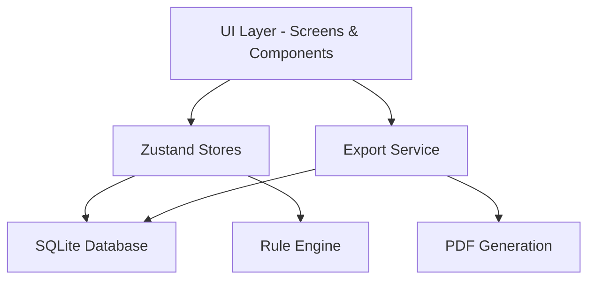

# PulseSense

A local-first, offline-capable mobile health companion built with React Native and Expo. PulseSense helps individuals and caregivers track personal vitals, manage medical information, and navigate medical emergencies using a rule-based triage engine -- all without requiring cloud connectivity.

> PulseSense is not a medical device. It does not provide diagnoses, treatment recommendations, or replace professional medical advice. Always consult a qualified healthcare provider for medical decisions.

---

## Features

- **Vital Tracking** -- Log standard vitals (heart rate, blood pressure, SpO2, temperature, blood glucose, respiratory rate, weight) and define custom vitals with custom names, units, and normal ranges.
- **Rule-Based Triage Engine** -- A deterministic, offline symptom assessment tool that evaluates symptom flags and vital thresholds against a predefined rule set. Results are sorted by severity and include actionable guidance.
- **Emergency Guidance** -- Step-by-step emergency action screen with BEFAST stroke assessment, location sharing, and one-tap emergency calling.
- **Medication Management** -- Structured medication logging with morning/afternoon/night dosage tracking and reminder scheduling.
- **Condition & Allergy Tracking** -- Card-based presentation of medical conditions and allergies for quick reference.
- **Emergency Contacts** -- Manage primary and secondary emergency contacts with quick-dial support.
- **PDF Export** -- Generate lab-report-style PDF exports for vitals history, medical ID summaries, and more -- fully offline, using on-device rendering.
- **Medical ID** -- A one-page shareable summary of critical medical information (conditions, allergies, medications, contacts).
- **Dark Mode** -- Full dark theme support across all screens.
- **Offline-First** -- All data is stored locally in SQLite. No account required, no data leaves the device.

---

## Tech Stack

| Layer          | Technology                                                    |
|----------------|---------------------------------------------------------------|
| Framework      | React Native with Expo SDK 54                                 |
| Language       | TypeScript 5.9                                                |
| Navigation     | @react-navigation/stack + @react-navigation/bottom-tabs       |
| State         | Zustand 4.5                                                    |
| Local Storage  | expo-sqlite (SQLite on-device), 13 tables with FK relations   |
| Charts         | react-native-gifted-charts                                    |
| Animations     | react-native-reanimated, moti                                 |
| PDF Generation | expo-print + expo-file-system + expo-sharing                  |
| Forms          | react-hook-form                                               |
| Testing        | Jest, @testing-library/react-native                           |

---

## Architecture

PulseSense follows a layered architecture with clear separation between the UI, logic, and data layers:

- **UI Layer** -- React Native screens and components using a consistent design system defined in constants (colors, typography, spacing).
- **State Management** -- Zustand stores (profileStore, settingsStore, alertStore) hydrated from SQLite on app start and kept in sync on mutation.
- **Database Layer** -- Typed query functions in `src/db/queries/` executing raw SQL against a local SQLite database. Migrations run automatically on version changes.
- **Rule Engine** -- Pure TypeScript function evaluating symptoms and vital thresholds against a deterministic rule set, producing sorted, severity-ranked results.
- **Export Service** -- Builds HTML templates from database data, renders to PDF via expo-print, and shares through the system share sheet.



---

## Getting Started

### Prerequisites

- Node.js 18 or later
- npm or yarn
- Expo CLI (`npx expo`)
- iOS Simulator (macOS) or Android Emulator (or a physical device with the Expo Go app)

### Installation

```bash
git clone https://github.com/yourusername/pulsesense.git
cd pulsesense
npm install
```

### Running the App

```bash
npm start
```

This starts the Expo development server. From there, you can:

- Press `i` to open in iOS Simulator
- Press `a` to open in Android Emulator
- Scan the QR code with Expo Go on a physical device

### Running Tests

```bash
npm test            # Run all tests
npm run test:watch  # Run tests in watch mode
npm run test:coverage  # Run tests with coverage report
```

---

## Project Structure

```
pulsesense/
├── assets/                  # Static assets (icons, splash screen)
├── Docs/                    # Project documentation
│   ├── PRD.md               # Product Requirements Document
│   ├── TRD.md               # Technical Requirements Document
│   ├── System_Architecture.md
│   ├── AppFlow.md
│   ├── UI-UX_Design.md
│   ├── UI_Design_Guide.md
│   ├── Backend_Schema.md
│   └── Implementation_Plan.md
├── src/
│   ├── __tests__/           # Test files
│   ├── components/          # Reusable UI components
│   │   └── vitals/          # Vital-specific components (charts, forms)
│   ├── constants/           # Design system (colors, typography, spacing, rules)
│   ├── db/
│   │   ├── queries/         # Typed SQL query functions per domain
│   │   ├── database.ts      # Database initialization
│   │   ├── migrations.ts    # Schema migrations
│   │   ├── schema.ts        # Table definitions
│   │   └── seeds.ts         # Seed data
│   ├── engine/              # Business logic
│   │   ├── ruleEngine.ts    # Triage rule evaluation
│   │   ├── healthInsights.ts # Health insight generation
│   │   └── drugInteractions.ts # Drug interaction checking
│   ├── screens/             # Screen components
│   │   ├── tabs/            # Tab screens (Home, Vitals, History, Profile, Alerts)
│   │   └── settings/        # Settings screens
│   ├── store/               # Zustand state stores
│   └── utils/               # Utility functions
├── index.ts                 # App entry point
├── package.json
├── tsconfig.json
└── jest.config.js
```

---

## Database Schema

PulseSense uses 13 SQLite tables with foreign key relationships. The schema covers:

- **Profiles** -- Core user information
- **Conditions** -- Medical conditions with ICD-10-like categorization
- **Allergies** -- Allergy records with severity
- **Medications** -- Structured prescriptions with M/A/N dosage
- **Vitals** -- Time-series vital sign records for 7 standard types plus custom vitals
- **Custom Vitals** -- User-defined vital type definitions
- **Emergency Contacts** -- Primary and secondary contacts
- **Alerts** -- Generated alerts from rule engine evaluations
- **Settings** -- User preferences and app configuration

Full schema documentation is available in `Docs/Backend_Schema.md`.

---

## Navigation

The app uses a bottom tab navigator with 5 tabs and a root stack for onboarding:

- **Home** -- Dashboard, quick vitals entry, emergency check access
- **Vitals** -- Log and manage vitals, define custom vitals
- **History** -- Tabular and chart views of vitals history
- **Profile** -- Manage profile, conditions, allergies, medications, contacts
- **Alerts** -- Alert history, export tools, settings

Onboarding is shown only once when no profile exists in the database.

---

## Testing

The project includes tests for:

- Rule engine logic (symptom and vital threshold evaluation)
- Export service and PDF template generation
- Zustand stores (profile, settings, alert, theme)
- Utility functions (date formatting, vital formatting, dosage formatting, vital status)
- Custom React hooks
- End-to-end app flow validation

Run tests with:

```bash
npm test
```

---

## Contributing

Contributions are welcome. Please follow these guidelines:

1. Open an issue to discuss proposed changes before submitting a pull request.
2. Write tests for new functionality.
3. Ensure all existing tests pass before submitting.
4. Follow the existing code style and architecture conventions.

---

## License

This project is licensed under the MIT License. See the [LICENSE](LICENSE) file for details.

---

## Disclaimer

PulseSense is a health information tool intended for reference and organizational purposes only. It is not a medical device, does not provide clinical decision support, and should not be used as a substitute for professional medical advice, diagnosis, or treatment. In an emergency, call your local emergency services immediately.
