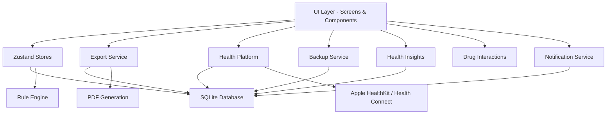

# PulseSense

A local-first, offline-capable mobile health companion built with React Native and Expo. PulseSense helps individuals and caregivers track personal vitals, manage medical information, monitor health trends, check drug interactions, and navigate medical emergencies using a rule-based triage engine — all without requiring cloud connectivity.

> PulseSense is not a medical device. It does not provide diagnoses, treatment recommendations, or replace professional medical advice. Always consult a qualified healthcare provider for medical decisions.

---

## Features

- **Vital Tracking** — Log standard vitals (heart rate, blood pressure, SpO₂, temperature, blood glucose, respiratory rate, weight) and define custom vitals with custom names, units, and normal ranges.
- **Rule-Based Triage Engine** — A deterministic, offline symptom assessment tool that evaluates symptom flags and vital thresholds against a predefined rule set. Results are sorted by severity and include actionable guidance.
- **Health Insights** — Automated trend analysis generating warning, info, and positive insights for blood pressure, pulse, SpO₂, glucose, weight, and data consistency — powered by an in-memory cached engine.
- **Drug Interactions Checker** — Check 120+ known drug-drug interactions across major medication categories (ACE inhibitors, anticoagulants, SSRIs, beta-blockers, statins, NSAIDs, and more) with severity levels.
- **Health Platform Sync** — Bidirectional sync with Apple HealthKit (iOS) and Google Health Connect (Android) via a unified platform adapter pattern. Supports heart rate, blood pressure, weight, SpO₂, and step count.
- **Emergency Guidance** — Step-by-step emergency action screen with BEFAST stroke assessment, location sharing, and one-tap emergency calling.
- **Medication Management** — Structured medication logging with morning/afternoon/night dosage tracking, reminder scheduling via local push notifications, and automatic rescheduling on changes.
- **Condition & Allergy Tracking** — Card-based presentation of medical conditions and allergies for quick reference.
- **Emergency Contacts** — Manage primary and secondary emergency contacts with quick-dial support.
- **PDF & CSV Export** — Generate lab-report-style PDF exports or CSV reports for vitals history, medical ID summaries, medications, and alerts — fully offline, using on-device rendering.
- **Backup & Restore** — Full database backup as JSON with FK-safe restore, schema version validation, column sanitization, and 50 MB size limit.
- **Medical ID** — A one-page shareable summary of critical medical information (conditions, allergies, medications, contacts).
- **Dark Mode** — Full dark theme support across all screens, persisted via Zustand store.
- **Onboarding Flow** — Guided 4-screen onboarding (Welcome, Features, Setup Profile, Ready) shown on first launch.
- **Touch-Interactive Charts** — Tap or hold on chart data points in the History tab to see exact values and dates.
- **Offline-First** — All data is stored locally in SQLite. No account required, no data leaves the device.

---

## Tech Stack

| Layer              | Technology                                                              |
|--------------------|-------------------------------------------------------------------------|
| **Framework**      | React Native 0.81.5 with Expo SDK ~54                                  |
| **Language**       | TypeScript ~5.9                                                         |
| **Navigation**     | @react-navigation/native ^7.0, stack + bottom-tabs                     |
| **State**          | Zustand ^4.5                                                            |
| **Local Storage**  | expo-sqlite ~16.0 (SQLite on-device), 14 tables with FK relations      |
| **Charts**         | react-native-gifted-charts ^1.4, react-native-svg 15.12                |
| **Animations**     | react-native-reanimated ~4.1, react-native-gesture-handler ~2.28       |
| **PDF Generation** | expo-print ~15.0 + expo-file-system ~19.0 + expo-sharing ~14.0         |
| **Notifications**  | expo-notifications ~0.32 (local push reminders)                        |
| **Health (iOS)**   | react-native-health ^1.19 (Apple HealthKit)                            |
| **Health (Android)** | react-native-health-connect ^3.5 + expo-health-connect ^0.1         |
| **Icons**          | @expo/vector-icons ^15.0                                               |
| **Fonts**          | @expo-google-fonts/outfit, roboto-mono, syne                           |
| **Location**       | expo-location ~19.0                                                    |
| **Testing**        | Jest ~29.7, @testing-library/react-native ^13.3, jest-expo ~54         |

---

## Architecture

PulseSense follows a layered architecture with clear separation between the UI, logic, data, and platform layers:

- **UI Layer** — React Native screens and components using a consistent design system defined in constants (colors, typography, spacing).
- **State Management** — Zustand stores (profile, settings, alert, theme) hydrated from SQLite on app start and kept in sync on mutation.
- **Database Layer** — Typed query functions in `src/db/queries/` executing raw SQL against a local SQLite database. Migrations run automatically on version changes.
- **Rule Engine** — Pure TypeScript function evaluating symptoms and vital thresholds against a deterministic rule set, producing sorted, severity-ranked results.
- **Health Insights Engine** — 8 detection functions analyzing recent vitals for trends (BP elevation, BP drop, pulse elevation, low SpO₂, glucose patterns, weight changes, no recent vitals, consistent normal readings).
- **Drug Interactions Engine** — 120+ interaction entries with severity-based categorization and case-insensitive partial name matching.
- **Export Service** — Three-tier architecture: HTML templates → PDF generation via expo-print, CSV generation, and an orchestrator with preview and share capabilities.
- **Health Platform** — Platform adapter pattern (`IOSAdapter` for Apple HealthKit, `AndroidAdapter` for Health Connect) with a lazy singleton and unified public API.
- **Backup Service** — JSON backup/restore with FK-safe restore (PRAGMA foreign_keys=OFF during re-insertion, reverse-dependency table clearing, schema version validation, column sanitization).



---

## Getting Started

### Prerequisites

- Node.js 18 or later
- npm or yarn
- Expo CLI (`npx expo`)
- iOS Simulator (macOS) or Android Emulator (or a physical device with the Expo Go app)

### Installation

```bash
git clone https://github.com/yourusername/pulsesense.git
cd pulsesense
npm install
```

### Running the App

```bash
npm start
```

This starts the Expo development server. From there, you can:

- Press `i` to open in iOS Simulator
- Press `a` to open in Android Emulator
- Scan the QR code with Expo Go on a physical device

### Running Tests

```bash
npm test                 # Run all tests
npm run test:watch       # Run tests in watch mode
npm run test:coverage    # Run tests with coverage report
```

---

## Project Structure

```
pulsesense/
├── assets/                    # Static assets (icons, splash screen)
├── Docs/                      # Project documentation
│   ├── PRD.md                 # Product Requirements Document
│   ├── TRD.md                 # Technical Requirements Document
│   ├── System_Architecture.md
│   ├── AppFlow.md
│   ├── UI-UX_Design.md
│   ├── UI_Design_Guide.md
│   ├── Backend_Schema.md
│   ├── Implementation_Plan.md
│   └── play_store_assets_guide.md
├── src/
│   ├── __tests__/             # Test files (unit + integration + E2E flow)
│   ├── components/
│   │   ├── conditions/        # Condition card components
│   │   ├── emergency/         # Emergency guidance components
│   │   ├── export/            # Export type selection components
│   │   ├── health/            # Health insight card components
│   │   ├── medications/       # Medication list components
│   │   ├── ui/                # Reusable UI primitives (Button, Card, Input, etc.)
│   │   └── vitals/            # Vital-specific components (charts, forms, tables)
│   ├── constants/             # Design system (colors, typography, spacing, rules)
│   ├── db/
│   │   ├── queries/           # Typed SQL query functions per domain (11 modules)
│   │   ├── database.ts        # Database connection manager (singleton, migrations)
│   │   ├── migrations.ts      # Schema migration runner (v1→v2)
│   │   ├── schema.ts          # Table definitions (14 tables + 15 indexes)
│   │   └── seeds.ts           # Default settings seed data
│   ├── engine/
│   │   ├── ruleEngine.ts      # Triage rule evaluation (symptoms + vitals)
│   │   ├── healthInsights.ts  # Trend analysis & insight generation (8 detectors)
│   │   ├── drugInteractions.ts # Drug interaction checker (120+ entries)
│   │   ├── healthPlatform.ts  # Platform adapter (HealthKit + Health Connect)
│   │   └── healthPlatformTypes.ts
│   ├── export/
│   │   ├── csvExport.ts       # CSV generation (5 export types)
│   │   ├── exportService.ts   # Orchestrator: PDF + CSV, preview, share
│   │   └── pdfTemplates.ts    # HTML template builders for PDF
│   ├── hooks/                 # Custom React hooks (useColors, useHealthInsights, etc.)
│   ├── navigation/            # Navigators (App, Tab, Onboarding stacks)
│   ├── screens/
│   │   ├── conditions/        # Add/edit condition screens
│   │   ├── emergency/         # Emergency check & action screens
│   │   ├── export/            # Export configuration screen
│   │   ├── medications/       # Add/edit medication & list screens
│   │   ├── onboarding/        # 4-screen onboarding flow
│   │   ├── settings/          # Settings & Health Connection screens
│   │   └── tabs/              # 5 tab screens (Home, Vitals, History, Profile, Alerts)
│   ├── services/
│   │   ├── backupService.ts   # JSON backup/restore with FK-safe restore
│   │   └── notificationService.ts # Medication reminder scheduling
│   ├── store/                 # Zustand stores (profile, settings, alert, theme)
│   └── utils/                 # Utility functions (dates, vitals, formatting)
├── index.ts                   # App entry point
├── app.json                   # Expo configuration
├── eas.json                   # EAS Build configuration
├── package.json
├── tsconfig.json
└── jest.config.js
```

---

## Database Schema

PulseSense uses 14 SQLite tables with foreign key relationships and 15 performance indexes. The schema covers:

| Table                  | Domain                   | Description                                      |
|------------------------|--------------------------|--------------------------------------------------|
| `profile`              | Core                     | User profile with birth date and blood type      |
| `settings`             | Core                     | User preferences and app configuration           |
| `conditions`           | Medical                  | Medical conditions with ICD-10-like categories   |
| `allergies`            | Medical                  | Allergy records with severity levels             |
| `emergency_contacts`   | Medical                  | Primary and secondary contacts                   |
| `medications`          | Medications              | Structured prescriptions with dosage schedule    |
| `medication_items`     | Medications              | Per-slot (M/A/N) medication records              |
| `custom_vital_definitions` | Vitals               | User-defined vital type definitions              |
| `vital_logs`           | Vitals                   | Time-series records for 7 standard vital types   |
| `custom_vital_logs`    | Vitals                   | Time-series records for user-defined vitals      |
| `symptom_events`       | Symptoms                 | Symptom log entries                              |
| `rule_triggers`        | Engine                   | Rule engine trigger history                      |
| `alerts`               | Engine                   | Generated alerts from rule engine evaluations    |
| `health_sync`          | Health Platform          | Sync metadata (last import/export timestamps)    |

Full schema documentation is available in `Docs/Backend_Schema.md`.

---

## Navigation

The app uses a bottom tab navigator with 5 tabs and a root stack for onboarding:

- **Home** — Dashboard, quick vitals entry, health insights summary, emergency check access
- **Vitals** — Log and manage vitals, define custom vitals, view recent readings
- **History** — Tabular and chart views of vitals history with table/charts toggle
- **Profile** — Manage profile, conditions, allergies, medications, contacts, Medical ID
- **Alerts** — Alert history, export tools (PDF/CSV), settings, backup/restore, health connections

Onboarding (Welcome → Features → Setup Profile → Ready) is shown only once when no profile exists in the database.

---

## Testing

The project includes tests for:

- Rule engine logic (symptom and vital threshold evaluation)
- Export service, PDF template generation, and CSV export
- Health insights engine and trend detection
- Drug interactions checker
- Health platform adapter (mock-based)
- Backup service (restore and export)
- Notification service (scheduling and cancellation)
- Zustand stores (profile, settings, alert, theme)
- Utility functions (date formatting, vital formatting, dosage formatting, vital status)
- Custom React hooks
- End-to-end app flow validation

Run tests with:

```bash
npm test
```

---

## Contributing

Contributions are welcome. Please follow these guidelines:

1. Open an issue to discuss proposed changes before submitting a pull request.
2. Write tests for new functionality.
3. Ensure all existing tests pass before submitting.
4. Follow the existing code style and architecture conventions.

---

## License

This project is licensed under the MIT License. See the [LICENSE](LICENSE) file for details.

---

## Disclaimer

PulseSense is a health information tool intended for reference and organizational purposes only. It is not a medical device, does not provide clinical decision support, and should not be used as a substitute for professional medical advice, diagnosis, or treatment. In an emergency, call your local emergency services immediately.
